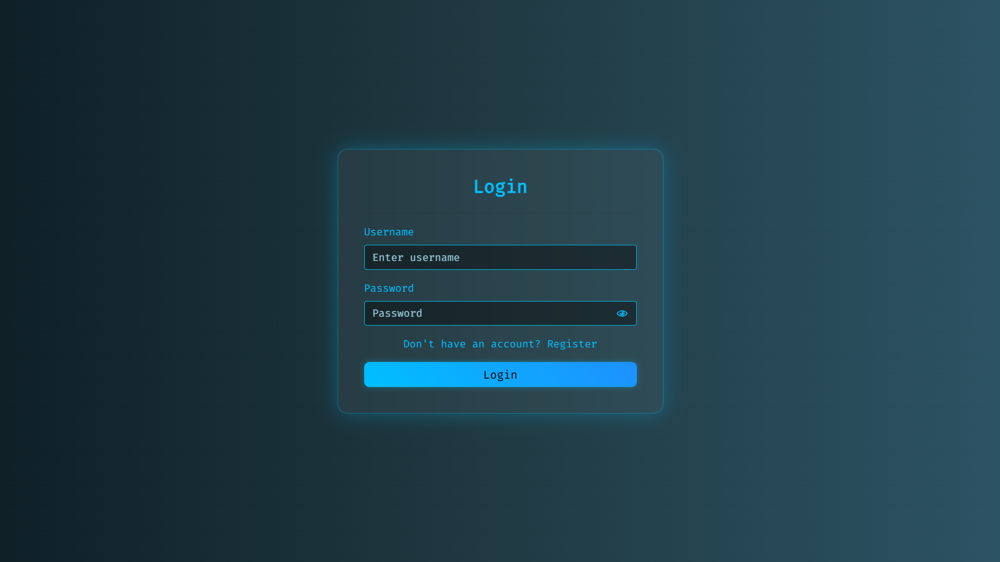
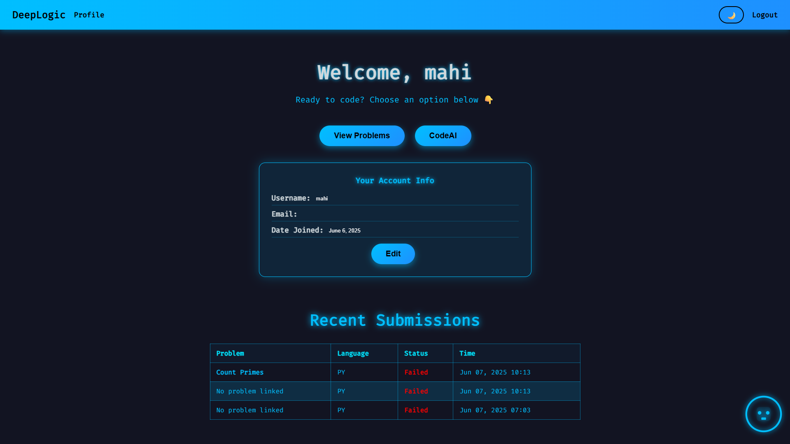
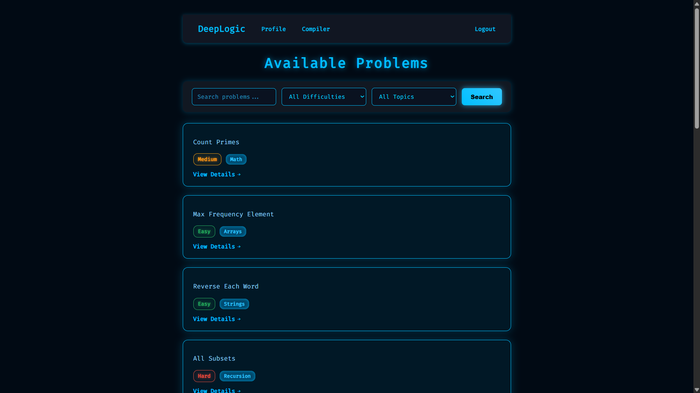
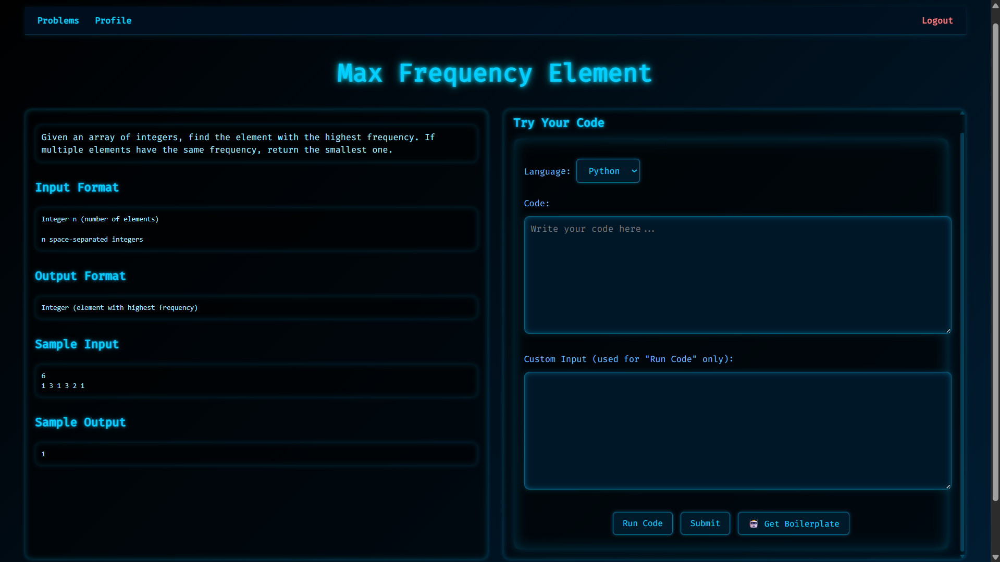

# DeepLogic

DeepLogic is a powerful Online Judge platform and code compiler system. It provides a space for users to solve coding problems, run code in multiple programming languages, and get real-time feedback. The system is built with a Django backend and a modern frontend using HTML, CSS, JavaScript, and Bootstrap.

---

## 🌟 Features

- 🔐 User registration, login, and profile management  
- 🌐 Cinematic landing page with automatic redirection to info page  
- ℹ️ Info page with project overview, features, and links  
- 📚 Problem list with detailed descriptions and constraints  
- ✍️ Integrated code editor with support for Python, C, C++, and Java  
- 🧪 Automatic test case execution and validation  
- 🤖 AI-assisted debugging and code explanation (OpenAI & Gemini APIs)  
- 🧑‍💻 Standalone compiler with multi-language support and AI help  
- 📜 Submission history tracking per user  
- ⚙️ Admin panel to manage problems and test cases  
- 💡 Responsive and clean UI using Bootstrap 5  

---

## 🧰 Tech Stack

| Layer        | Tech                                  |
|--------------|---------------------------------------|
| Backend      | Django (Python)                       |
| Frontend     | HTML, CSS, JavaScript, Bootstrap 5    |
| Database     | SQLite (development), PostgreSQL (production) |
| Code Exec    | Subprocess (Docker-ready)             |
| Deployment   | AWS (Elastic Beanstalk / EC2 / RDS)   |
| AI Debugging | Google Gemini API        |


---

## 🚀 Getting Started

### 1. Clone the Repository

```bash
git clone https://github.com/Deepu-Mahi/DeepLogic.git
cd DeepLogic

```
### 2. Setup Virtual Environment

```bash
python -m venv env
source env/bin/activate      # For Linux/Mac
env\Scripts\activate         # For Windows

```
### 3. Install Requirements

```bash
pip install -r requirements.txt

```
### 4. Migrate Database

```bash
python manage.py migrate
```
### 5. Create Superuser (Optional)
```bash
python manage.py createsuperuser
```
### 6. Run the Server
```bash
python manage.py runserver
```
## 🖥️ Frontend Overview

- Built using **HTML5**, **CSS3**, **JavaScript**, and **Bootstrap 5**
- Clean, responsive layout across all screen sizes
- Pages include:
  - 🌐 Landing Page


  - 🔐 Login/Register


  - 🧑‍💻 Profile with Submission History


  - 📃 Problem List


  - 📘 Problem Detail (with Code Editor)


- Bootstrap components used for layout, modals, buttons, and responsiveness
- JavaScript enables form validation and real-time UI interactivity

---

## 📁 Project Structure

```
DeepLogic/
├── compiler/ # Django project configuration
├── submit/ # Django app for submissions and logic
│ ├── templates/ # HTML templates
│ ├── static/ # CSS, JS, and images
│ └── views.py # Core backend logic
├── db.sqlite3 # Development database (ignored in prod)
├── keys/ # Secrets (ignored via .gitignore)
├── .env # Environment variables (ignored)
├── .gitignore # Git ignore file
└── README.md # This file
```
---

## ⚠️ Important

The following files are ignored using `.gitignore` for safety:

```
.DS_Store
db.sqlite3
migrations/
pycache/
.env
keys/
backup.json
```
## 🤝 Contributing

Want to contribute? Awesome! Follow these steps:

1. Fork the repo
2. Create a new branch  
   ```bash
   git checkout -b feature-name
3. Commit your changes
   ```bash
   git commit -m "Added feature"
4. Push to the branch
   ```bash
   git push origin feature-name
5. Open a Pull Request
   ```
## 📄 License
---
MIT © 2024 Your Name

## 📬 Contact

Made with ❤️ by **Deepu Mahi**

- GitHub: [github.com/Deepu-Mahi](https://github.com/Deepu-Mahi)
- Email: msmahisupradeep@gmail.com
